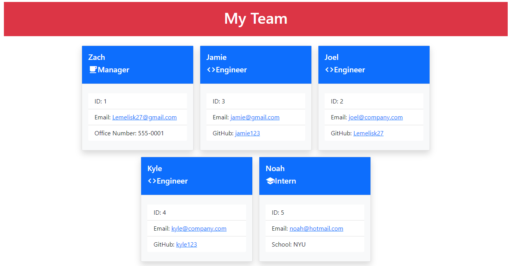

# Team Profile Generator
## Description
This is a Node.js application that will take information about employees on a software engineering team. It will then generate an HTML document that displays summaroed for each person.
  
# Usage
From the terminal run: node index.js
  

  
## Credits
Zach Smith - [GitHub Profile](https://github.com/Lemelisk27)
  
## Questions
If you have any questions you can contact me directly at Lemelisk27@gmail.com. You can find more of my work at [Lemelisk27](https://github.com/Lemelisk27)